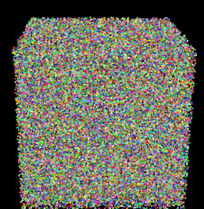

# Eigen, CUDA and PCL
This repository is created to show how to work with eigen and pcl on GPU:
  - Generates a 2000000 random points using Eigen::Vector4f
  - Convert this points into PCL points in CUDA
  - On the official pcl::gpu defination added new function to avoid cudaDeviceSynchronize() when needed.
  

## Authors

* **Yonas Teodros Tefera** - *Development and testing * - [Yonasteodros.tefera@gmail.com](Yonasteodros.tefera@gmail.com)
